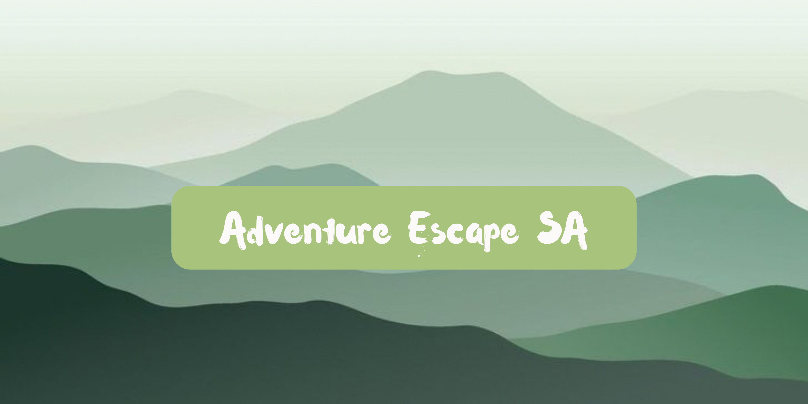

# Adventure Escape SA Website

## Authors
- Luyanda Mnisi
- Thabang Raboroko
- Tshwarelo Makgae

## About the Website
Adventure Escape SA is an adventure tourism website designed to help visitors explore outdoor activities and adventure packages. The website provides information about the company, available adventure experiences, package prices, safety guidelines, booking options, and contact details.

The website aims to make it easy for users to discover adventures, compare packages, learn about activities, and plan their next outdoor experience.

## Website Pages and Team Contributions

The website consists of pages, each  was developed by a different team member.

### Tshwarelo Makgae

**Pages developed:**

1. **Home Page** – Introduces Adventure SA, showcases featured adventure packages, and explains why customers should choose the company.
2. **About Us Page** – Presents the company's history, goals, vision, mission, and adventure activities.
3. **Our Adventure Packages Page** – Displays available adventure packages, descriptions, prices, and booking options.
4. **Ultimate Adventure Day Page** – Provides information about the Ultimate Adventure Day package, activity options, and safety guidelines.

### Thabang Raboroko

**Pages developed:**

1. **Family Explore Package Page** – Showcases the family package, photographs, included activities, and package information.
2. **Mountain Adventure Page** – Describes mountain adventures and lists included activities such as hiking, scenic viewpoints, and rock scrambling.
3. **Corporate Team Challenge Page** – Presents team-building activities and provides an enquiry form.
4. **Ziplining Adventure Page** – Displays ziplining experiences, equipment information, and safety rules.

### Luyanda Mnisi

**Pages developed:**

1. **Kayaking Experience Page** – Provides kayaking information, photographs, included services, and safety requirements.
2. **Rock Climbing Session Page** – Describes the rock-climbing experience, included services, and safety requirements.
3. **Book Your Adventure Page** – Allows visitors to enter their details, select packages, and calculate their booking total.
4. **Contact Adventure SA Page** – Provides contact information, a location overview, and a way for visitors to make enquiries or plan their adventure.

## Technologies and Tools Used

- **HTML** – Used to structure the website pages and content.
- **Visual Studio Code (VS Code)** – Used as the code editor during website development.
- **Images** – Used to showcase adventure activities and make the website visually appealing.
- **GitHub** – Used to store and share the project repository.

## Main Website Features

- Navigation between the website pages.
- Company information and an introduction to Adventure SA.
- Adventure package listings and prices.
- Individual pages for specific adventure activities.
- Safety rules and guidelines for selected activities.
- Booking form with package selection and booking-total calculation.
- Contact details and location information.
- Adventure photographs and a consistent visual design.

## Website Design

The website uses an outdoor-adventure theme to reflect the nature of the activities offered by Adventure Escape SA.

The design includes:
- A navigation bar for accessing the different pages.
- Adventure images and package cards.
- Green, beige, and orange colours.
- Clear headings and structured content.
- Booking buttons and contact sections.
- A consistent footer across the pages.

## How to Run the Website

1. Download or clone this repository from GitHub.
2. Open the project folder in Visual Studio Code.
3. Locate the main HTML file, usually named `Home.html`.
4. Open the HTML file in a web browser.
5. Alternatively, use the Live Server extension in VS Code to run the website locally.

Ensure that all HTML, and image files remain in their correct folders so that the website loads properly.

## Project Notes

- The website is structured using HTML.

## Team Responsibilities Summary

| Team Member | Assigned Pages | Number of Pages |
|---|---|---:|
| Tshwarelo Makgae | Home, About Us, Adventure Packages, Ultimate Adventure Day | 4 |
| Thabang Raboroko | Family Explore, Mountain Adventure, Corporate Team Challenge, Ziplining Adventure | 4 |
| Luyanda Mnisi | Kayaking Experience, Rock Climbing Session, Book Your Adventure, Contact Adventure SA | 4 |

---

**Project Name:** Adventure Escape SA  
**Primary Language:** HTML  
**Development Environment:** Visual Studio Code  
**Repository Platform:** GitHub
